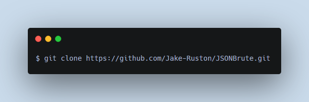
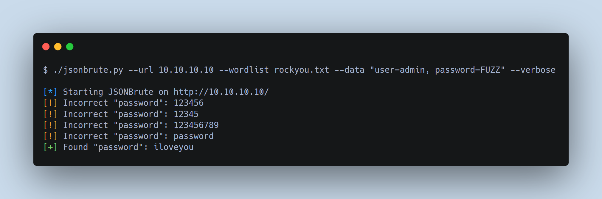

# JSONBrute

A simple JSON bruteforce tool for penetration testers or hobbyists.

## Disclaimer
I do not condone nor claim any responsibility for non-authorized use of this program.

Use at your own discretion.

## Why is this useful?
Have you ever been on an engagement where you've had to bruteforce a JSON API, and industry standard tools such as [hydra](https://github.com/vanhauser-thc/thc-hydra) and [wfuzz](https://github.com/xmendez/wfuzz) can't handle the data type? That's where JSONBrute excels.

## Installation

## Usage

## Checklist
- [x] Create an argument parser
- [x] Get each word in the given wordlist
- [x] Make a request to the given URL for each word
- [x] Send the given data to the URL for each word
- [x] Replace the FUZZ keyword with each word
- [x] Allow fields other than username/password to be used
- [ ] Error checking
	- [ ] URL given
	- [ ] Data given
	- [ ] Wordlist given
	- [ ] Request exception
- [ ] Threading

## TODO
- [ ] Move separate functionality into their own files
- [ ] Fix the `verbose` and `code` arguments in the help display
- [ ] Use a more efficient way to replace the FUZZed word with the entry in the given wordlist
- [x] Add extra argument for verbosity
- [x] Add extra argument for status code
- [ ] Add extra argument for user agent